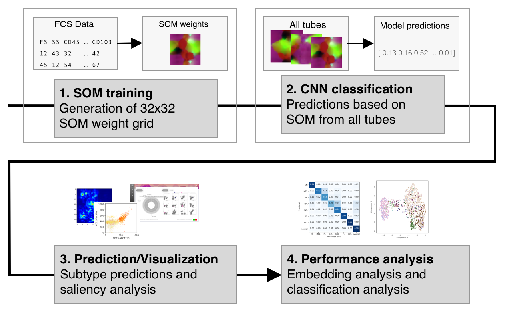

flowCat: Automated classification of MFC data
=============================================


flowCat is a classifier and visualizer for flow cytometry data. The classifier
uses self-organized maps for representing raw ungated flow cytometry data. A CNN
is then used for generating predictions.



The processing of a single sample involves:

1. Transformation of FCS into SOM
2. CNN prediction
3. Generation of Saliency Mappings
4. Potential embedding analysis and other batched methods

## System requirements

The SOM generation and classification both require tensorflow, so a recent
NVIDIA GPU is preferable. The system has been internally used using a GTX1080
and a P40. If Video RAM is a limitation, reducing the batch size for the SOM
generation might be beneficial.

Software dependencies needed are:

* tensorflow 1.12

Other python dependencies should be correctly installed by pip. Use that on the
downloaded wheel file.

```sh
$ pip install /path/to/wheel
```

### Conda-based setup

Installation in a conda environment is preferable for better management of
dependencies.

Download [miniconda](https://docs.conda.io/en/latest/miniconda.html) and the
following commands could be used to setup a conda environment.

```sh
$ conda activate
$ conda create -n flowcat python=3.6
$ conda activate flowcat
```

Afterwards follow the main instructions for installing the flowCat package.


### Setup for development

Clone this repository and then install via issuing:

```
$ python3 setup.py develop
```

Optionally this should be done in a specific python environment to avoid
collisions with other versions of the same python libraries.

## Usage

flowCat can be either used entirely as a command line utility or its components
can be used in custom python scripts.

The command line utility can be used to manipulate properly formatted datasets
and transform these into SOM datasets. Custom data sources and other formattings
should be transformed using custom python scripts using flowCat as a library.

```sh
$ flowcat --help  # overview of available commands
```

### Library usage

A main convenience library in `flowcat.flowcat` is available, containing a
simplified interface to the major functions required for classification and SOM
generation.

## Contributions

tensorflow SOM code adapted from cgorman.
